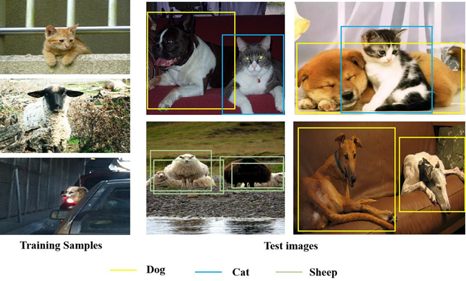

Figure A. Prediction results of ECEA in an image with multiple occlusion objects. Since the first row belongs to different objects, each category can be accurately predicted. Since the objects of the first image in the second row are the same, the prediction bounding boxes range is larger, but no object feature is missed. Secondly, it could correctly predict the two dogs without occluding each other.

